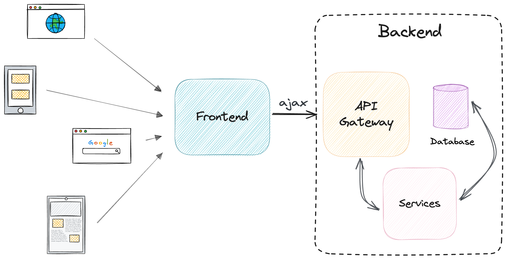
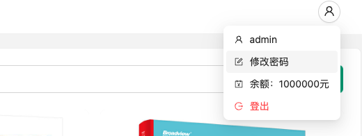

# 电子书城前端

该 repo 为上海交通大学课程“互联网应用开发技术(SE2321)” 的前端 demo 项目，供同学们学习参考。
欢迎点亮✨，发表你的 issue 或 pr，为课程建设贡献一份力。如果你想参与问题、技术讨论，欢迎使用本 repo 的[讨论模块](https://github.com/Okabe-Rintarou-0/BookStore-Frontend/discussions)。

UI 设计上，在不删减基本功能的前提下，保证尽可能的简洁明了。项目主要使用 `Ant Design` 框架，请参考 [Ant Design 5.0](https://ant-design.antgroup.com/index-cn) 学习各类组件使用方法。

<div align="center">
    
    
</div>

<p align="center">
    
    
    
    
    
    
     
</p>

各类文档 👉 [文档索引](./docs/README.md)，[课程要求](./public/requirements.pdf)，[进阶教程](./advanced_tutorial/README.md)

## ⚠️注意
<h3>
请一定要做好版本管理，每一次小变更都可以用 git commit 保存。每一次大变更都可以 checkout 出一个新分支方便随时切换。每年都有学生因为答辩时出现问题无法回滚历史代码而失分。
</h3>

为了便于同学们专注开发前端，我们提供了后端服务。但是由于你们本地的前端（localhost）到我们的远程后端属于是跨站调用，这就会引发跨站传递 `Cookies` 的问题：[Cookie Samesite简析](https://zhuanlan.zhihu.com/p/266282015)。`Chrome` 浏览器在不需要更改偏好设置的情况下就能正常使用，而 `Edge` 和 `Safari` 对 `SameSite` 识别解析有一定问题，所以我们推荐使用 `Chrome`。

> 部分浏览器不支持部分SameSite=none。IOS 12 的 Safari 以及老版本的一些 Chrome 会把 SameSite=none 识别成 SameSite=Strict，所以服务端必须在下发 Set-Cookie 响应头时进行 User-Agent 检测，对这些浏览器不下发 SameSite=none 属性。

上面的问题你暂时看不懂也不要紧。请注意，后续你们在本地进行开发的时候没有任何（主流的）浏览器限制，只不过每一种浏览器 UI 会有些许变化。你们本地开发前后端也不会有跨站问题（localhost:3000 -> localhost:8080）。

## 什么是前端

一个最简单的前后端架构图：



> 前端一词是指用户可以直接与之交互的图形用户界面（GUI），例如导航菜单、设计元素、按钮、图像和图表。采用技术术语，用户看到的带有多个 UI 组件的页面或屏幕称为文档对象模型（DOM）。—— [应用程序开发中的前端和后端之间有什么区别？](https://aws.amazon.com/cn/compare/the-difference-between-frontend-and-backend/)

## 项目结构

```
├── ...
├── Dockerfile          Docker 镜像构建文件
├── package-lock.json   记录当前安装的 npm 包的确切版本
├── package.json        包含项目的元数据和依赖项信息
├── public              存放静态资源，如 HTML 文件、图片等
└── src                 包含项目的源代码
    ├── App.js          项目的根组件
    ├── components      React 组件
    ├── css             css 样式文件
    ├── index.js        项目的入口文件
    ├── lib             工具函数、工具类
    ├── page            包含不同页面的组件，如首页、购物车页面
    ├── service         后端交互的服务或 API 请求的代码
    └── utils           通用的工具函数或帮助函数
```

## IDE 选择

一般而言开发前端没有什么“非它不可”的 IDE。我个人推荐 `vscode`（配合一些插件, 如 `EsLint`, `Es7+` 就已经可以很方便地开发了）。如果你对 `jetbrains` 公司的产品有执念，那么用 `webstorm` 之类的也可以。

## 环境配置

请下载最新版本的 [nodejs(21.x)](https://nodejs.org/en/download/current)。如果你使用的是 macOS，建议使用 [Homebrew](https://brew.sh/) 安装。
如果你学过 python 的话，你应该清楚 pip 是一个功能强大的包管理器。与其类似，你可以选择 `npm` 或者 `yarn` 作为 node 的包管理器。

通过以下命令，你可以轻松启动前端项目（推荐）：
```bash
# 使用 npm
npm install && npm start

# 使用 yarn
yarn install && yarn start
```

对于 `npm` 下载速度慢的问题，可以考虑使用淘宝源、腾讯源或者 [SJTUG 镜像源](https://mirrors.sjtug.sjtu.edu.cn/docs/npm-registry)，具体换源命令请自行检索，推荐使用 `nrm` 工具管理源。

`npm install` 下载项目所需的依赖（只需执行一次即可，后续无需再执行）；`npm start` 则会启动前端项目。与 `Makefile` 类似，你也可以在 `package.json` 中定义自己的指令（你可以由此发现 `npm start` 是如何启动项目的）：

```json
"scripts": {
    "start": "react-scripts start",
    "build": "react-scripts build",
    "test": "react-scripts test",
    "eject": "react-scripts eject"
},
```

请确保进入 `package.json` 文件所在的目录后再执行上述命令。如果一切顺利，你会发现当前目录下生成了一个名为 `node_modules` 的目录，这里面是下载的第三方库（项目依赖）。启动后，你可以在 http://localhost:3000 访问前端。

如果你希望快速新建一个 `React` 项目，请参考：[create-react-app](https://create-react-app.dev/docs/getting-started) 或者 [vite](https://vitejs.dev/)。**我们更推荐大家使用后者**。

## 部署指南

https://private-user-images.githubusercontent.com/58595459/307246663-287189a8-0767-4014-81d4-9b555ca407d7.mp4?jwt=eyJhbGciOiJIUzI1NiIsInR5cCI6IkpXVCJ9.eyJpc3MiOiJnaXRodWIuY29tIiwiYXVkIjoicmF3LmdpdGh1YnVzZXJjb250ZW50LmNvbSIsImtleSI6ImtleTUiLCJleHAiOjE3NDAyNzQ4MzMsIm5iZiI6MTc0MDI3NDUzMywicGF0aCI6Ii81ODU5NTQ1OS8zMDcyNDY2NjMtMjg3MTg5YTgtMDc2Ny00MDE0LTgxZDQtOWI1NTVjYTQwN2Q3Lm1wND9YLUFtei1BbGdvcml0aG09QVdTNC1ITUFDLVNIQTI1NiZYLUFtei1DcmVkZW50aWFsPUFLSUFWQ09EWUxTQTUzUFFLNFpBJTJGMjAyNTAyMjMlMkZ1cy1lYXN0LTElMkZzMyUyRmF3czRfcmVxdWVzdCZYLUFtei1EYXRlPTIwMjUwMjIzVDAxMzUzM1omWC1BbXotRXhwaXJlcz0zMDAmWC1BbXotU2lnbmF0dXJlPWQzMzQ3ZTU0NTMyODg2NWVlYWZlYTAyYzhkOTg2NWU4NDk3ZjA4OWM1YjdiZDk1MTFmYjc1NTQzYjA1Mjk3MDEmWC1BbXotU2lnbmVkSGVhZGVycz1ob3N0In0.qtcn2m09u3tw28RX5Wqg_WFj1NWH0WP5oG6UlfxVhAw

## 后端 API

我们开源了完整的前端项目，但是为了防止同学们照抄后端代码，所以只提供了后端 API 及其文档（你可以在启动前端后在 http://localhost:3000/api-docs 查看文档）。后端 API 采用 [RESTful](https://zhuanlan.zhihu.com/p/334809573) 形式。请在 `.env` 文件中修改环境变量 `REACT_APP_BASE_URL` 的值为我们提供的后端服务器的 URL。

如果你想调试 API，请查看[后端 API 使用指南](./docs/API_usage.md)。如果你想在前端中调用后端 API，请参考：[Sending a request with credentials included](https://developer.mozilla.org/en-US/docs/Web/API/Fetch_API/Using_Fetch#sending_a_request_with_credentials_included) 等文档。

如果你使用 [vite](https://vitejs.dev) 来创建自己的项目，需要注意项目源代码之中
```javascript
export const BASEURL = process.env.REACT_APP_BASE_URL ?? 'http://localhost:8080';
```
是设置了使用npm启动时的环境变量，你需要将其修改成：
```javascript
export const BASEURL = import.meta.env.VITE_REACT_APP_BASE_URL ?? "http://localhost:8080";
```
的形式，并将所有在 `.env` 之中定义的环境变量加上 `VITE_` 前缀以向 `vite` 标识。

请注意，如果你已经启动了前端项目，请先 CTRL + C 强制终止前端进程，然后再次重启，修改的环境变量才会生效。在校外的同学可能需要开启 [SJTUvpn](https://net.sjtu.edu.cn/wlfw/VPN.htm) 才能正常访问后端。

我们暂时不提供注册功能，你可以使用我们给定的账号密码登录，并按照如下方式修改密码：



## 学习指南
本课程主要学习 `React` 框架，学有余力的同学也可以尝试一下 `Vue`。如果你感兴趣，这边也提供了 `Vue` 版本以供参考：[BookStore-Frontend-Vue](https://github.com/Okabe-Rintarou-0/BookStore-Frontend-Vue) 。

### 函数式组件
React 使用 JSX 来定义组件，支持两种方式：类组件和函数式组件。由于便利性，现在大家倾向于使用后者进行开发。函数式组件最令人头疼的就是各种 hooks（钩子函数）。所以学会各种 hooks 的用法是学好 React 的关键。

+ [useState](https://legacy.reactjs.org/docs/hooks-state.html): 
  
    State 是 React 中最核心的理念。当一个组件的状态发生改变的时候，React 会对其进行重新渲染。当我们希望进行**交互**，或者是渲染**动态**组件，我们就会用到状态。useState 会返回一个**元组**，第一个元素是状态变量。第二个则是设置该状态变量的函数（详见链接）。

    常见误区：
    + Q：为什么我修改了状态，但是页面没有重新渲染？
        ```javascript
        const [count, setCount] = useState(1);
        return <>
            <button onClick={()=>{count+=1;}}>Increase</button>
            <p>Count: {count}</p>
        </>
        ```
        A：只有通过 setCount 函数修改变量才会触发重新渲染。
    + Q：我明明用了 set 函数，为什么依然没有渲染？
        ```javascript
        const [tags, setTags] = useState([]);
        return <>
            <button onClick={()=>{
                tags.push("tag");
                setTags(tags);
            }}>Add tag</button>
            {tags.map(tag => (<p>{tag}</p>))}
        </>
        ```
        A：tags 的地址没有改变（数组和对象是引用类型），所以 React 认为它没有被修改。
        正确做法：
        
        ```javascript
        setTags([...tags, "tag"]);
        ```
+ [useEffect](https://legacy.reactjs.org/docs/hooks-effect.html)：提供生命周期管理、在依赖项修改时触发。
  
    如果你希望在组件挂载之后做一些事情（例如初始化工作），你可以将第二个参数依赖项设置为空数组，这样就等同于类组件的 `componentDidMount` 生命周期函数。
    ```javascript
    useEffect(()=>{
        // do something here
    }, []);
    ```
    > If you want to run an effect and clean it up only once (on mount and unmount), you can pass an empty array ([]) as a second argument. This tells React that your effect doesn’t depend on any values from props or state, so it never needs to re-run. This isn’t handled as a special case — it follows directly from how the dependencies array always works.

    如果你希望监视某些值的变化，那就加入到依赖项中（这一功能非常重要，你可以从链接中的例子看到这一点）：
    ```javascript
    useEffect(() => {
        // do something when someVar changes
    }, [someVar]);
    ```
    

    你可以返回一个函数用于进行组件 unmount 时的额外处理。
    ```javascript
    useEffect(() => {
        return () => {
            // do some cleanup here
        };
    });
    ```

    常见误区：
    + 死循环：
        以下代码将产生死循环，请注意依赖是否正确使用。
        ```javascript
        useEffect(() => {
            setSomeVar(newValue);
        }, [someVar]);
        ```
        在没有依赖情况下，如果你在 useEffect 中修改状态，就会触发再次渲染，useEffect 又会被调用，形成死循环。
        ```javascript
        useEffect(() => {
            setSomeVar(newValue);
        });
        ```
+ [useRef](https://zh-hans.react.dev/reference/react/useRef)：帮助引用一个不需要渲染的值，见链接介绍。
+ [useMemo](https://zh-hans.react.dev/reference/react/useMemo)：在每次重新渲染的时候能够缓存计算的结果，见链接介绍。
+ [useLocation](https://reactrouter.com/en/main/hooks/use-location)：获取前端当前 URL.
+ [useSearchParams](https://reactrouter.com/en/main/hooks/use-search-params)：获取 URL query 参数。
+ [useNavigate](https://reactrouter.com/en/main/hooks/use-navigate)：用于进行页面跳转。
+ [useParams](https://reactrouter.com/en/main/hooks/use-params)：获取 URL 路径参数（例如 "/path/:id"，你可以通过以下方式获取该参数）
    
    ```javascript
    const {id} = useParams(); 
    ```

### 异步函数

异步函数也是一大重点，建议大家学习好两种方式：**回调函数** 和 **await** 方式，本项目均采用后者，避免过多回调函数产生不美观和“回调地狱”。
可以参考：

+ [什么是回调地狱，如何用Promise解决回调地狱，看完这篇你就明白了。](https://juejin.cn/post/7108187709076111367)

### 闭包陷阱

当你在箭头函数中发现一个变量怎么样都拿不到最新的值的时候，很可能是因为你遇到了“闭包陷阱”。
请参考：[一文讲透 React Hooks 闭包陷阱](https://juejin.cn/post/7230819482012237861)

解决方案：使用 [useRef](https://zh-hans.react.dev/reference/react/useRef)。

### 避免 CSS 冲突
请参考：[react 中 css modules-基本使用](https://juejin.cn/post/7031528538209681444)

### 依赖添加

见[依赖添加指南](./docs/add_deps.md)。

### 养成良好的习惯

+ javascript 里面判断变量相等应该用 `===`。
+ 对于列表组件，每一项都需要 `key` 属性：[列表 & Key](https://zh-hans.legacy.reactjs.org/docs/lists-and-keys.html) 。`key` 属性很重要，React 利用 key 来识别组件，它是一种身份标识标识，就像我们的身份证用来辨识一个人一样。每个 key 对应一个组件，相同的 key 会被认为是同一个组件，这样后续相同的 key 对应组件都不会被重新创建。
+ 善用浏览器开发者工具：控制台、网络、[React Developer Devtools 插件](https://chromewebstore.google.com/detail/react-developer-tools/fmkadmapgofadopljbjfkapdkoienihi)、[React Query Devtools](https://tanstack.com/query/latest/docs/framework/react/devtools)...
+ 需要复用、较复杂的组件应进行封装，避免嵌套过深、重复编码。
+ 学会 Mock：[「前端该如何优雅地Mock数据🏃」每个前端都应该学会的技巧](https://segmentfault.com/a/1190000041457114)

## Tricks

+ 字符串格式化

    ```javascript
    const num = 123;
    const str = `number is ${num}`;
    ```

    这将产生字符串"number is 123"。

+ 简洁的条件渲染
  
    ```javascript
    {shouldShow && <SomeComponent/>}
    ```
    `shouldShow` 是一个 bool 类型的变量，当且仅当其为真，渲染后面的组件。这种写法最为简洁，也不失可读性。

+ 提取对象字段

    ```javascript
    const person = {"name": "Bob", "age": 12}
    // 可以取别名
    const {
        name: nameAlias,
        age
    } = person;
    ```

+ bool 类型的组件属性可以简写
    ```javascript
    // case 1
    <Modal open />
    // equals to
    <Modal open={true} />
    
    // case 2
    <Modal />
    // equals to
    <Modal open={false} />
    ```

+ 便捷的函数式编程
  
    基本上函数式都会支持 `map`、`filter` 和 `reduce` 操作。下面的代码将产生一系列组件。
    ```javascript
    function ArrayComponents({ array }) {
        return array.map(item => <div>{item}</div>);
    }    
    <ArrayComponents array={[1, 2, 3]}/>
    ```

    这三种函数非常常用，尤其是 `map`，请熟练掌握其用法，增加编程效率。

+ 箭头函数

    基本上可以完美代替 `function`，编码方便（还有一个好处是不容易出现this指针相关的问题）。注意返回类型如果是如下形式（返回一个对象，因为JSX语法对`{}`的解释有函数体和对象的二义性）请加括号以标识返回为对象：

    ```javascript
    let func = book => ({
        id: book.id,
        title: book.title
    });
    ```

    正如上述例子所示，只有一个参数的情况下参数可以不加括号。
+ Javascript 中的 `?` 运算符

    ```javascript
    const func = (obj) => {
        console.log(obj?.id);
    };

    func({id: 1});   // 输出 1
    func(null);      // 输出 undefined
    func([]);        // 输出 undefined
    func(undefined); // 输出 undefined

    // 调用函数
    let handleFunc = null;
    handleFunc();    // 报错：Uncaught TypeError: handleFunc is not a function
    handleFunc?.();  // 无报错且无任何效果

    handleFunc = () => {
        console.log("HELLO WORLD!");
    };
    handleFunc?.(); // 无报错且函数被执行，输出 HELLO WORLD!

    // 支持链式
    let someAttr = obj?.nested?.attr;
    ```

+ Javascript 中的 `??` 运算符

    作用：
    + 当左侧的操作数为 `null` 或 `undefined` 时，返回右侧的操作数。
    + 否则，返回左侧的操作数。
    
    请明确其与 `&&` 效果的差异：
    + 当左侧和右侧的操作数都为真时，返回右侧的操作数。
    + 否则，返回左侧的操作数。

    ```javascript
    let NULL = null;
    let UNDEFINED = undefined;
    let STRING = "Hello World!";
    let STRING2 = "I Like React!";

    console.log(NULL ?? STRING);      // 输出 Hello World!
    console.log(UNDEFINED ?? STRING); // 输出 Hello World!
    console.log(STRING ?? STRING2);   // 输出 Hello World!
    console.log(STRING2 ?? STRING);   // 输出 I Like React!

    
    console.log(NULL && STRING);      // 输出 null
    console.log(UNDEFINED && STRING); // 输出 undefined
    console.log(STRING && STRING2);   // 输出 I Like React!
    console.log(STRING2 && STRING);   // 输出 Hello World!
    ```

+ Javascript 中的 `...` 运算符

    作用在数组上就是将数组展开：

    ```javascript
    let array = [1, 2, 3];
    let newArray = [...array, 4]; // [1, 2, 3, 4]
    ```

    作用在对象上：
    ```javascript
    let obj = {
        id: "1"
    };
    let newObj = {
        ...obj,
        name: "object"
    };
    ```
    等价于：
    ```javascript
    let newObj = {
        id: "1",
        name: "object"
    };
    ```
    顺带一提，如果变量和对象的 key 名字相同，则可以简化赋值表达：
    ```javascript
    let book = {
        title: "chiikawa"
    };
    let title = "chiikawa2";
    book = {
        title
    };
    ```

## 插件推荐

+ [React1s](https://chromewebstore.google.com/detail/gpcoahaomdfmekggblkckofkgjggnjlp): 点击页面元素跳转到编辑器。

## 一些示例
+ [获取输入组件的值](https://codesandbox.io/p/sandbox/example-1-monitor-input-value-w873x6?file=%2Fsrc%2FApp.js)
+ [使用 React Context](https://codesandbox.io/p/sandbox/example-2-context-cwltjm)
+ [在 React 中引入图片](https://codesandbox.io/p/sandbox/example-3-image-import-gw2h7w?file=%2Fsrc%2FApp.tsx%3A28%2C14-36%2C13)

## 进阶

+ 使用 Typescript 代替 Javascript。
+ 使用 [useSWR](https://swr.vercel.app/zh-CN) / [React Query](https://cangsdarm.github.io/react-query-web-i18n/react/getstarted/quick-start/) + [axios](https://www.npmjs.com/package//axios) 代替 `fetch` 方案；
+ 使用 [React.createContext](https://zh-hans.react.dev/reference/react/createContext) React原生方法，或者 [Redux](https://cn.redux.js.org/)、[Zustand](https://docs.pmnd.rs/zustand/getting-started/introduction#first-create-a-store) 等全局状态管理器更方便地传递上下文。（为什么要使用这些？了解React开发之中的 [Props Drilling](https://www.geeksforgeeks.org/what-is-prop-drilling-and-how-to-avoid-it/) 问题）

## 致谢

感谢以下用户为本仓库做出的贡献：

<table>
  <tr>
    <td align="center">
      <a href="https://github.com/Ayanami1314" style="display:inline-block;width:80px">
        <br/>
        <sub><b>Ayanami1314</b></sub>
      </a>
    </td>
  </tr>
</table>

## Star History

[](https://star-history.com/#Okabe-Rintarou-0/BookStore-Frontend&Date)
