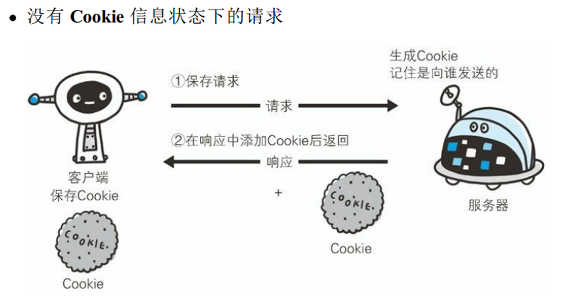

# 后端 API 使用指南

+ 工具：[Apifox](https://apifox.com/)（你也可以使用 [Postman](https://www.postman.com/)）

    

+ 什么是后端（backend）？

    

## ☝️第一步，登录

一般而言，后端会对未认证的请求加以拦截，这是一种有效的防护机制。所以，如果你没有在你的请求中附带你的身份认证信息（在我们的系统中是 `Cookies`，当然现在用的更多的是 `Token`），你大概率会得到 401、403 之类的无权限 HTTP 状态码。

所以，要想使用后端的完整功能，你必须先登录，以获得后端返回的 `Cookies`。虽然你现在估计还没学过 `Cookies` 是什么，但是我想用我很喜欢的一本书《图解 HTTP》中的两张图带你快速理解它。

由于 HTTP 协议是无状态的，你必须通过一些额外的数据结构来存储你的登录信息；此外，服务器为了记住你，也会存储一些用户会话信息。当然，这个存储是有过期时间的，这就是为什么你太久没登录某个网站就会要求你重新登录。当然，这些都是后话了，别担心，你迟早都会学到的。

接下来，我们来进行 Apifox 的一系列操作，以完成第一步——登录。

+ 新建个人项目

    

+ 添加登录请求

    

+ 查看登录 API 文档，复制返回 JSON 示例

    

+ 选择通过 JSON 导入

    

+ Apifox 会自动帮你保存 `Cookies`

    > 在 Apifox 中，通常会自动解析并保存响应中的 Cookie。也就是说，当在 Apifox 中发送请求并收到响应时，它会自动解析响应头中的 Set-Cookie 字段，并将相应的 Cookie 保存在 Cookie 管理器中。这样，当你发送下一个请求时，Apifox 会自动在请求头中包含之前保存的 Cookie，以便与服务器端进行交互。——[Apifox 发请求时如何自动获取Cookie 和 token](https://apifox.com/blog/cookies-and-token/)

+ 保存后进入运行界面，填入对应的 JSON（你的用户名账号）

    

+ 在右上角找到“管理环境”

   

+ 填入我们给的后端 URL，并保存
  
    

+ 将右上角的环境切换成你刚配置的环境

+ 点击运行即可，如果登录成功，下面的 response body 应该长这样：

    

## ✌️第二步，测试其他接口

除了登录接口外，其他接口都是会拦截未登录的请求的，这里我们测试一下这个接口：

老样子，新建一个接口，然后运行：

成功🎉！

