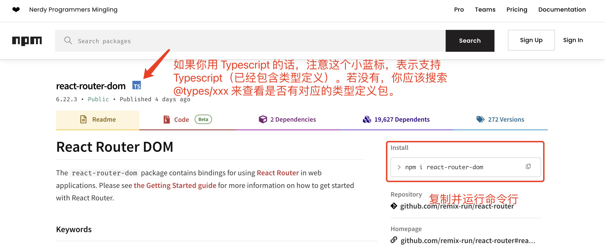

# 依赖添加指南

+ 访问网址：[npmjs](https://www.npmjs.com/)，或者 [yarnpkg](https://yarnpkg.com/)
+ 搜索要下载的包，比如 react-router-dom：   

    

+ 注意根据你的需求决定是否使用 `-D` flag
  
    `-D` 即 `development`。该 flag 表明下载的依赖仅在开发时使用，例如你想用 `scss`，可以：`npm i -D scss`。