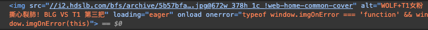

# 后端开发指南

## 推荐阅读
+ [Session/Cookie/Token 还傻傻分不清？](https://mp.weixin.qq.com/s/5oFKdbFWgZrwqESNTZn77w)
+ [Spring Data JPA](https://docs.spring.io/spring-data/jpa/reference/jpa/query-methods.html)

## 使用 lambok 简化你的代码

```java
@Data
@NoArgsConstructor
@AllArgsConstructor
class SomeEntity {}
```

`@Data` 帮你实现了 `getter` 和 `setter`。

## 如何使用 jwt

参见：https://github.com/auth0/java-jwt

## 如何维护 Http Session

写一个 SessionUtils，框架帮你维护 Session 数据结构。JSESSIONID 对应一个 session，每个 session 都是一个类似 map 的 key-value 存储结构。

```java
public class SessionUtils {
    public static void setSession(UserAuth userAuth) {
        ServletRequestAttributes servletRequestAttributes = (ServletRequestAttributes) RequestContextHolder.getRequestAttributes();
        if (servletRequestAttributes != null) {
            HttpServletRequest request = servletRequestAttributes.getRequest();
            HttpSession session = request.getSession();
            session.setAttribute("userId", userAuth.getUserId());
            session.setAttribute("identity", userAuth.getIdentity());
        }
    }

    private static HttpSession getSession() {
        ServletRequestAttributes requestAttributes = (ServletRequestAttributes) RequestContextHolder.getRequestAttributes();
        if (requestAttributes != null) {
            HttpServletRequest request = requestAttributes.getRequest();
            return request.getSession(false);
        }
        return null;
    }
}
```

## 登陆拦截器

```java
@Component
public class SessionInterceptor implements HandlerInterceptor {
    @Override
    public boolean preHandle(HttpServletRequest request, HttpServletResponse response, Object handler) {
        HttpSession session = request.getSession(false);
        // Do something here
        return true;
    }
}
```

```java
@Configuration
public class SessionConfig implements WebMvcConfigurer {
    @Autowired
    private SessionInterceptor sessionInterceptor;

    @Override
    public void addInterceptors(InterceptorRegistry registry) {
        registry.addInterceptor(sessionInterceptor)
                .addPathPatterns("/**")
                .excludePathPatterns("/xxx");
    }
}
```


## 图片存储格式指南

一般而言，后端存储图片可以存图片的 URL（背后需要有一个文件服务器，不建议用第三方图床，文件服务器肯定是自己维护的）；或者是以 base64 格式存储图片。

+ 存储 URL

    我们随便找一个 bilibili 封面图片：

    

    `i2.hdslb.com` 就是 B 站的文件服务器，除了文件服务器，有些还会使用 `CDN(内容分发网络)` 来推送内容。

    前面说了，不推荐使用图床，所以如果你希望存储图片的 URL，你可以开启一个简易的文件服务器，然后存储文件服务器请求对应图片的 url。

    Spring Boot 支持开启静态资源服务，你可以参考这篇文章学习其使用方法：[Springboot多种方法处理静态资源：设置并访问静态资源目录](https://juejin.cn/post/7022823623844954142)。在开启服务后，你就可以通过 `localhost:8080/resources/xxx.png` 获取图片（/resources 这种路径是你设置的，此处只做说明）。这里在存储的时候，可以省略域名，只存 "/resources/xxx.png"，返回的时候进行拼接。

+ 存储 base64

    可以通过 base64 的方式表示一张图片：

    ``

    上面直接在 `src` 中使用了 base64 编码，也就是说前端支持直接使用 base64 显示图片。你可以在 https://www.base64-image.de/ 上看看将图片转化为 base64 之后其格式如何。

    base64 会将图片大小增加约 1/3，虽然减少了一次 http 请求，但是增大了文件体积。你可以在后端数据库直接存储 base64，然后传输给前端直接显示。

两种方式最直观的区别就是前者图片不存入数据库，后者则反之。