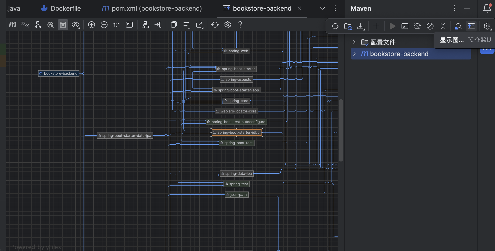

# Idea 操作指南

## 导入数据库

Idea（Jetbrains 家的产品，专业版都）支持连接数据库和执行 sql 语句：

你可以在右上角点击下图中高亮的部分，然后新建数据源，通过填写一系列基础信息便可以连接到指定的数据库。

以下图中的 MySQL 数据库为例，你可以点击 `1/7` 这个小按钮，选择需要显示的 `database`（此处是指 MySQL 中的 database）。

然后，右键数据库便可以创建查询控制台，执行 sql 语句：

## 依赖相关的操作

当我们修改 `pom.xml` 时，请务必记住点击右上角红框框起来的按钮同步依赖（此时会去下载更新的依赖）：

有时候我们需要查看某些依赖是怎么被引入的（java 经常会因为引入依赖版本问题导致错误），可以点击下图中的按钮查看依赖图：

## 清除缓存

